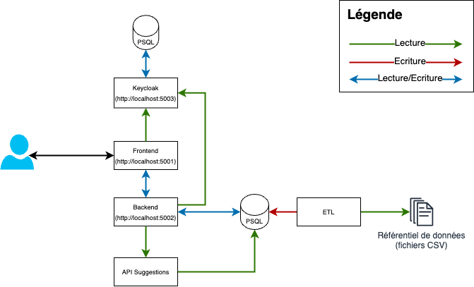

# MonProjetSup
Ce repository est un mono-repo qui contient plusieurs applications nécessaires au fonctionnement de Mon Projet Sup

## Applications contenu dans le repo
- **v1** - L'application historique (ce dossier est amené à disparaitre)
- **etl** - Permet de transformer les fichiers référentiels et ajouter les données en BDD (pour le moment dans V1)
- **suggestions** - API permettant de générer des suggestions de formations (pour le moment dans V1)
- **keycloak** - Gestionnaire d'authentification (n'est pas déployé, utilisé uniquement pour le dev local)
- **site-public** - Export statique des fichiers du WP permettant d'alimenter les pages publiques (non utilisé en local, uniquement pour le déploiement)
- **app** - Cœur de l'application Mon Projet Sup
  - front - Frontend Typescript/React/ViteJS
  - back - Backend API Kotlin/Spring Boot

## Schéma simplifié des apps et des types d'échanges en local

## Comment lancer le projet
### Prérequis 
- Démarrer Docker sur sa machine
- À la racine du projet lancer la commande : `docker compose -f docker-compose.dev.yml up`
- Lancer le backend en suivant les instructions de [app/back/README.md](app/back/README.md)
- Lancer le frontend en suivant les instructions de [app/front/README.md](app/front/README.md)
- Lancer l'api Suggestion en suivant les instructions de [v1/back/README.md](v1/back/README.md)

## Les différentes URLs
- Frontend: http://localhost:5001
- Swagger Backend: http://localhost:5002/swagger-ui/index.html/
- Keycloak: http://localhost:5003

## Comment se connecter 
Le keycloak de ce repo est déjà préconfiguré avec des comptes d'accès.

### Se connecter au Keycloak en tant qu'admin (gérer les comptes, les royaumes...)
- Url: http://localhost:5003
- Login: admin
- Mot de passe: password

### Se connecter à l'application en tant qu'élève
- Url: http://localhost:5001
- Login: eleve
- Mot de passe: password

### Se connecter à l'application en tant qu'enseignant
- Url: http://localhost:5001
- Login: enseignant
- Mot de passe: password

## Déploiement de l'application
- Lors du push sur la branch `demo` ou `prod` et une fois les CI validées le code va être push sur un repo privé Gitlab appartenant à Avenir(s) sur les branches respectives correspondants aux différents environnements. 
- Ce push va déclencher automatiquement le build et le deploy de l'application uniquement pour la branch `demo`.
- Pour la branch `prod` il est nécessaire de le faire manuellement dans l'interface gitlab du repo Avenir(s).
- À ce stade du projet nous n'utilisons que l'environnement `preprod` et `prod` chez Avenir(s). 

